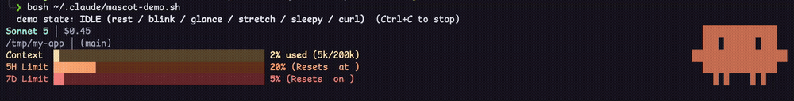

# clawd-line

A statusline for Claude Code with Clawd, an animated crab mascot that reacts to what Claude is actually doing — context, usage limits, cost & reasoning effort, all at a glance. One line to install on macOS, Linux & Windows.

<div align="center">

[Quick Install](#-quick-install) · [Features](#features) · [How it works](#how-it-works) · [Requirements](#requirements)

[](https://github.com/virvick/clawd-line/stargazers)
[](#-quick-install)
[](https://github.com/catppuccin/catppuccin)
[](#-quick-install)
[](LICENSE)

</div>



## Features

- **Clawd the mascot** — a pixel-art crab rendered with half-block Unicode characters, animated per-tick:
  - **Thinking**: eyes shift up and glance left/right while Claude is composing a response
  - **Executing**: claws tuck in and legs shuffle while a tool call is in flight
  - **Idle**: occasional blink, glance, stretch, or curl so it isn't a frozen statue between turns
- **Context usage bar** — gradient-shaded, shows % of context window used and token count
- **5-hour / 7-day rate limit bars** — gradient-shaded, with human-readable reset times
- **Model, reasoning effort, extended thinking, and session cost**
- **Working directory + git branch**

## 🚀 Quick Install

On Windows you don't need jq, Git, or Git Bash — the installer and the statusline itself are both native PowerShell.

**macOS / Linux**

```bash
curl -fsSL https://raw.githubusercontent.com/virvick/clawd-line/main/install.sh | bash
```

**Windows (PowerShell)**

```powershell
irm https://raw.githubusercontent.com/virvick/clawd-line/main/install.ps1 | iex
```

If your security software blocks `irm | iex`, download the installer first, inspect it, then run it:

```powershell
Invoke-WebRequest -Uri https://raw.githubusercontent.com/virvick/clawd-line/main/install.ps1 -OutFile .\install.ps1
notepad .\install.ps1
powershell -NoProfile -ExecutionPolicy Bypass -File .\install.ps1
```

Or clone and run:

```bash
git clone https://github.com/virvick/clawd-line.git && cd clawd-line
./install.sh            # macOS / Linux
./install.ps1           # Windows PowerShell
```

Then restart Claude Code (or start a new session). That's it.

The installer:
1. On macOS/Linux, makes sure `jq` is available (installs it via Homebrew/apt if missing) — Windows needs nothing extra
2. Copies `clawd-line.sh` (or `clawd-line.ps1` on Windows) to `~/.claude/`
3. Points Claude Code's `statusLine` at it in `~/.claude/settings.json` — merging into your existing settings, never overwriting other keys (a timestamped backup is taken first)

### Uninstall / revert

Your previous `settings.json` is backed up at `~/.claude/settings.json.bak.<timestamp>` during install. Restore it, or just edit the `statusLine.command` key back to whatever it was before.

## How it works

Claude Code invokes the statusline command on every render with a JSON payload on stdin (model, cost, context usage, rate limits, transcript path, etc.). `clawd-line.sh`/`clawd-line.ps1` reads that, renders 5 lines of colored text, and figures out Clawd's mood by peeking at the tail of the transcript JSONL referenced in the payload — no polling, no background process.

`clawd-line.ps1` is a full native PowerShell port — same mascot/gradient-bar logic, but JSON parsing via `ConvertFrom-Json` and git branch detection by reading `.git/HEAD` directly, so it needs nothing beyond PowerShell itself (no bash, jq, or Git required).

See the comments in `clawd-line.sh` for the full breakdown of the rendering approach (bit-string sprite patterns, half-block packing, frame-counter persistence for animation).

## Requirements

**macOS / Linux**: `bash`, `jq`, `python3` (for transcript parsing and Unicode display-width calculation)

**Windows**: PowerShell only (`clawd-line.ps1` is dependency-free)

Both: a terminal font with decent Unicode block character support (most modern terminal fonts qualify)

## License

MIT — see [LICENSE](LICENSE).
